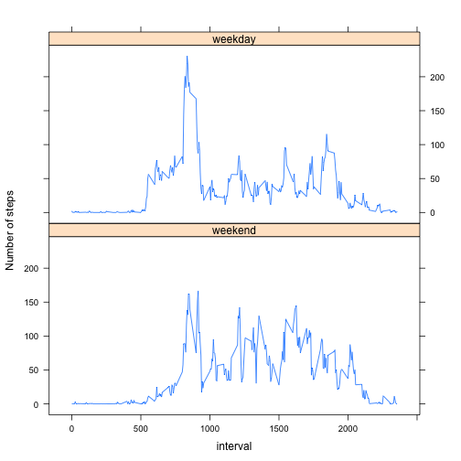

# Reproducible Research: Peer Assessment 1

## Loading and preprocessing the data

```r
activity <- read.csv("activity.csv")
activity$date <- as.Date(activity$date)
activity$datetime <- as.POSIXlt(activity$date) + (activity$interval %/% 100)*60*60 + (activity$interval %% 100)*60
activity$time_interval <- format(activity$datetime, "%H:%M")

s <- activity[(!is.na(activity$steps)),]
```

## What is mean total number of steps taken per day?

```r
steps_sum <- by (s$steps, s$date, sum)
print("Original data set without NA values")
```

```
## [1] "Original data set without NA values"
```

```r
print(paste("Avg steps taken per day:", mean(steps_sum)))
```

```
## [1] "Avg steps taken per day: 10766.1886792453"
```

```r
print(paste("Median steps taken per day:", median(steps_sum)))
```

```
## [1] "Median steps taken per day: 10765"
```

## What is the average daily activity pattern?

```r
hist(steps_sum)
```

 

```r
mean_by_interval <- as.table(by(s$steps, s$time_interval, mean))
plot(mean_by_interval, type="l", xlab="Time of day (5min interval)", ylab="Avg steps taken")
```

 

```r
max(mean_by_interval)
```

```
## [1] 206.2
```

```r
x <- mean_by_interval[mean_by_interval == max(mean_by_interval)]
print(paste("Most active interval: ", names(x), "with", x, "avg steps"))
```

```
## [1] "Most active interval:  08:35 with 206.169811320755 avg steps"
```

## Imputing missing values

```r
###Calculate and report the total number of missing values in the dataset (i.e. the total number of rows with NAs)

print(paste("Total number of missing values:", nrow(activity)-nrow(s)))
```

```
## [1] "Total number of missing values: 2304"
```

```r
###Create a new dataset that is equal to the original dataset but with the missing data filled in
a2 <- activity[is.na(activity$steps),]
intervals <- rownames(mean_by_interval)
mean_by_interval <- cbind(mean_by_interval, intervals)
colnames(mean_by_interval) <- c("mean", "time_interval")
x <- cbind(a2, mean_by_interval)
x <- subset(x, select=date:mean)
colnames(x)[5] <- "steps"
filled_activity <- rbind(s, x)
filled_activity$steps <- as.numeric(filled_activity$steps)
steps_sum2 <- by(filled_activity$steps, filled_activity$date, sum)

print("Data set with NA values filled with mean of the 5-minute interval")
```

```
## [1] "Data set with NA values filled with mean of the 5-minute interval"
```

```r
print(paste("Avg steps taken per day:", mean(steps_sum2)))
```

```
## [1] "Avg steps taken per day: 10766.1886792453"
```

```r
print(paste("Median steps taken per day:", median(steps_sum2)))
```

```
## [1] "Median steps taken per day: 10766.1886792453"
```

```r
# classify each reading as weekend or weekday reading
filled_activity$dow <- weekdays(filled_activity$date)
filled_activity$workday <- factor(filled_activity$dow)
levels(filled_activity$workday) <- list(weekend=c("Saturday", "Sunday"), weekday=c("Monday", "Tuesday", "Wednesday", "Thursday", "Friday"))

# calculate and plot 5-minute interval (x-axis) and the average number of steps taken, 
# averaged across all weekday days or weekend days (y-axis)
library(plyr)
workday_summary <- ddply(filled_activity, .(workday, interval), summarize, mean=mean(steps))
library(lattice)
workday_plot <- xyplot(mean ~ interval | workday, data=workday_summary, layout=c(1,2), type="l", ylab="Number of steps")
print(workday_plot)
```

 

## Are there differences in activity patterns between weekdays and weekends?
### The data suggests that there is more activity taking place on weekdays mornings than weekend mornings, but weekend afternoons are slightly more active than weekday afternoons

